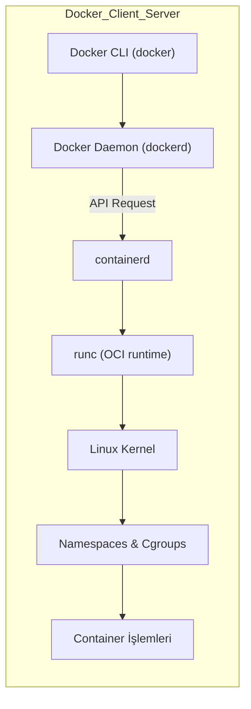

# Yönetici Özeti (Container - Docker)
Bu rapor konteyner teknolojisini ve Docker ekosistemini kapsamlı şekilde ele almaktadır. Öncelikle konteyner kavramı tanımlanmış, tarihçe ve VM’lerden farklarına (kaynak kullanımı, izolasyon, performans) değinilmiştir. Ardından konteynerlerin Linux çekirdeği düzeyinde nasıl çalıştığı açıklanmıştır: Namespaces, cgroups, chroot, OverlayFS/union dosya sistemleri ve konteyner imaj katman yapısı irdelenmiştir. Open Container Initiative (OCI) standartları ve konteyner yürütücüleri (runc, containerd) özetlenmiştir. Docker’ın mimarisi (daemon, CLI, registry) ve Dockerfile ile imaj oluşturma süreci anlatılmıştır; imaj ve konteyner arasındaki fark vurgulanmıştır. 

Sonrasında Docker CLI komutları kategorilere ayrılarak incelenmiştir: **image**, **container**, **network**, **volume**, **system**, **swarm** ve **compose** komutları tablo halinde özetlenmiş; her bir komutun sözdizimi, seçenekleri ve kullanım örnekleri ile birlikte tipik hatalar ve çözümleri verilmiştir. Örnek Dockerfile ve *docker-compose.yml* dosyaları, çok aşamalı (multi-stage) yapılandırma, ağ ve hacim (volume) örnekleri, günlükleme (logs) ve hata ayıklama yöntemleri sunulmuştur. 

Son olarak konteyner güvenliği, performans optimizasyonu, kaynak kısıtlama ve en iyi uygulamalar ele alınmıştır. Çekirdek güvenlik özellikleri (namespaces, cgroups), Docker’ın varsayılan saldırı yüzeyi, en az ayrıcalık prensibi gibi konular işlenmiş; küçük temel imajlar, çok aşamalı derlemeler, `.dockerignore` kullanımı gibi performans ve boyut optimizasyon teknikleri üzerinde durulmuştur. Çıktıda gerçek komut ve kod blokları, mermaid diyagramlar ve bir sorun çözümü vaka çalışması örneği bulunmaktadır.

## Tanım ve Tarihçe

**Docker Nedir?**
Geliştiricilerin en sık karşılaştığı *"Benim bilgisayarımda çalışıyordu, sunucuda neden çalışmıyor?"* sorununu çözen devrimsel bir araçtır. Bir uygulamanın çalışması için gereken her şeyi (Node/Python sürümü, kütüphaneler, ortam değişkenleri vb.) uygulama ile birlikte tek bir pakete dönüştürür. Bu sayede uygulamanızı ister kendi bilgisayarınızda, ister bambaşka bir işletim sisteminde çalıştırın; hiçbir kurulum karmaşası yaşamadan **her yerde aynı standartta** çalışmasını garantilersiniz.

**Neden Containerization? (Çakışma Problemi ve Çözümü)**
Aynı bilgisayarda veya sunucuda birden fazla bağımsız servis (örn. Backend, Frontend, Veritabanı) çalıştırırken genellikle bağımlılık kavgaları yaşanır. 
- Bir proje *Node 16* isterken diğeri *Node 20* isteyebilir veya iki servis de aynı portu (örn. 3000) dinlemeye çalışabilir.

Docker, her bir servisi birbirinden tamamen izole edilmiş kutulara (**Container**) koyarak bu sorunu kökten çözer:
- Her servisin ortamını hazırlayan kendi `Dockerfile` tarifi vardır.
- Kutular (Container'lar) birbirinin içine karışmaz. Birinde *PostgreSQL 14* varken diğerinde *PostgreSQL 16* tamamen sorunsuz çalışabilir.
- Her servis sadece kendi işine odaklanır, istenilen diller ve sürümler özgürce kullanılır.

**Özetle:** Docker, işletim sistemi ile container'lar arasında köprü kurarak; uygulamaların bağımsız, izole (çakışmasız) ve taşınabilir olmasını sağlayan mükemmel bir paketleme çözümüdür.

**Konteyner (Teknik Tanım):**  
Konteyner, uygulamaları izole bir ortamda çalıştırmak için işletim sistemi seviyesinde sanallaştırma sağlayan bir teknolojidir. Her konteyner, çalıştırılacak uygulama için gerekli tüm kütüphane ve dosyaları içeren **kendine yeten** birimdir, ve diğer konteynerlere veya ana makineye *minimal* etki yapar. İçlerinde ayrı bir işletim sistemi yerine aynı çekirdeği paylaşan birer işlem olarak çalışırlar. Bu sayede bir sunucuda VM’lere kıyasla çok daha yüksek yoğunlukta konteyner barındırmak mümkündür; konteynerler genellikle **megabayt (MB)** büyüklükte iken VM’ler gigabaytlarca yer kaplar, saniyeler içinde ayağa kalkabilirler. Kaynak kullanımı düşük, taşınabilirlik (portabilite) yüksek olan konteynerler, sürekli entegrasyon ve dağıtım (CI/CD) gibi senaryolarda hızlı devreye alma sağlar.

Konteyner fikrinin kökleri 1979’da Unix V7’de *chroot* çağrısının getirdiği dosya sistemi izolasyonuna kadar uzanır. 2000’lerde FreeBSD jails, OpenVZ, Solaris Zones gibi teknolojiler konteyner benzeri izolasyonu sağlarken, Linux tarafında 2006 yılında cgroups (Control Groups) çekirdeğe eklendi. 2008’de **LXC** (Linux Containers) çekirdek özelliklerini kullanan ilk yaygın konteyner yöneticisi olarak ortaya çıktı. 2013 yılında Docker’ın çıkışıyla konteyner teknolojisi hızla popülerleşti ve konteyner ekosistemi zenginleşti. Örneğin Docker’ın ilk sürümleri LXC kullanırken, daha sonra kendi çalışma zamanı katmanını (libcontainer/runc) geliştirdi. Sonuçta OCI (Open Container Initiative) çatısı altında evrensel imaj ve çalışma zamanı spesifikasyonları tanımlandı.

**Konteyner–Sanal Makine Karşılaştırması:** VM’ler her biri tam bir işletim sistemine sahip konuk makineler olup donanım seviyesinde sanallaştırma yapar; çekirdek dahil tüm yazılımı çalıştırdıkları için kaynak kullanımı yüksektir. Konteynerler ise ortak çekirdeği paylaşır, yalnızca uygulamanın gereksinimlerini barındıran dosya sistem katmanları ile paketlenir. Bu sebeple sanal makineler genellikle “*Kaynak Yoğun*” iken, konteynerler daha hafif ve taşınabilirdir. Örneğin bir konteyner genellikle **MB** büyüklüğündeyken, VM birkaç **GB** olabilmektedir; konteynerlerin başlama süresi saniyelerle ölçülürken VM’lerin başlatılması dakikaları bulabilir. VM’ler donanım seviyesinde izolasyon sağladığından güvenlik/düzenleme açısından avantajlı olabilir, ancak konteynerler ise yüksek yoğunluk, taşınabilirlik ve hızlı dağıtım gerektiren modern uygulamalar için tercih edilir.

## Teknik Çalışma Prensibi  
Konteynerlerin “kapsül” mantığı aslında Linux çekirdeğinin sunduğu izolasyon mekanizmalarına dayalıdır. Docker veya Podman gibi bir konteyner motoru, çekirdeğin sağladığı bu özellikleri bir araya getirerek kullanım kolaylığı sunar. Temel bileşenler şunlardır:

- **Çekirdek Namespaces (Ad Uzayları):** Farklı ad alanları sayesinde her konteyner kendi işlem ağacını, kullanıcı kimliklerini, IPC (süreçler arası iletişim) nesnelerini, dağıtım noktalarını, ağ yığınını vb. izole eder. Örneğin ağ isim alanı (network namespace) her konteynere kendine ait sanal ağ arabirimi sağlar. Bu sayede bir konteyner içindeki süreçler, başka bir konteynerdeki süreçleri veya host işlemleri göremez. Docker çalıştırma komutu çağrıldığında arka planda ilgili ad alanları otomatik oluşturulur. Çekirdek geliştiricileri *‘konteyner’* gibi tek bir yapıyı çekirdek seviyesinde tanımlamak yerine, bu çeşitli teknolojileri (namespaces, SELinux etiketi vb.) serbestçe birleştirerek izolasyon sağlar. Grafik olarak:



- **Cgroups (Kontrol Grupları):** Bu çekirdek özelliği süreçlerin kaynak tüketimini sınırlar ve izler. Cgroups sayesinde her konteynerin kullanabileceği CPU süresi, bellek, disk I/O, ağ bant genişliği vb. kısıtlanabilir. Örneğin `--memory` veya `--cpus` bayrakları ile konteynere hard bellek veya CPU sınırı koyulur. Bu, bir konteynerin tek başına tüm sisteme bellek açlığı saldırısı (DoS) gerçekleştirmesini önler. Cgroups aynı zamanda kaynak kullanımını raporlar ve birden çok süreç gruplanarak yönetilebilir (örn. `docker stats` çıktısında her konteynerin kullandığı miktarı görürüz). Docker’da bir konteyner motoru çalıştırıldığında otomatik olarak bir cgroup hiyerarşisi oluşturulur ve içerideki işlemlere bu sınırlamalar uygulanır.

- **Chroot (Dosya Sistemi Köklendirme):** En eski izole etme tekniği olan chroot, bir işlemin kök dizinini değiştirmesine izin vererek dosya sistemi düzeyinde sınırlama sağlar. Unix V7’de 1979’da tanıtılan bu mekanizma, bir işlemi kendi alt dizinine “hapsetmek” suretiyle temel izolasyon sunmuştur. Modern konteynerler chroot’un ötesinde üst üste bindirilmiş dosya sistemleri (overlay) kullanır, ancak mantık olarak chroot izolasyonun başlangıcı sayılır.

- **OverlayFS (Union Dosya Sistemi):** Konteyner imajlarındaki katmanlı yapı burada devreye girer. OverlayFS, Linux çekirdeğindeki bir birleşim (union) dosya sistemidir ve birden fazla dizini tek bir görünümde birleştirir. Docker’da her imaj katmanı, altındaki katmana eklenen/değiştirilen dosyaları içerir. Overlay2 sürücüsü ile bir konteyner diski, çoğu zaman *alt* (`lowerdir`) ve *üst* (`upperdir`) olarak iki dizinin birleştirilmiş görünümünden (`merged`) oluşur. Örneğin bir `ubuntu` imajında katmanlar, dosya sisteminde diske alınarak bir *overlay* dosya sistemi oluşturulur. OverlayFS’nin avantajı, ayrı katmanların ortak dosyaları tekrar etmeden paylaşılmasına izin vererek depolama verimliliği ve hızlı imaj oluşturma sağlar. Docker Engine 29 ve sonrası containerd tabanlı snapshotter ile çalışır; önceki sürümlerde kullanılan `overlay2` sürücüsü Docker tarafından sağlanan bir overlay uygulamasıdır.

- **Konteyner İmaj Katmanları:** Her Docker imajı ardışık katmanlardan oluşur; her katman belirli dosya ekleme, silme veya değiştirme işlemlerini tutar. Bir imaj immutable (değiştirilemez) olarak paketlenir; yeni özellik eklemek için mevcut imaja bir katman daha eklenir. Örneğin bir `node:14` imajını temel alıp uygulama kodunu eklemek, yeni bir katman oluşturur. Katman bazlı yapı, ortak alt katmanların yeniden kullanımı sayesinde disk tasarrufu ve inşa hız kazancı sağlar.

- **Çalıştırma Zamanı (Runtime):** Docker, konteynerleri yürütmek için OCI (Open Container Initiative) standartlarına uyumlu bir runtime kullanır. Docker’ın açık kaynak referans runtime’ı **runc**’dır; bu, OCI runtime-spec ile uyumlu basit bir konteyner çalıştırıcısıdır. Docker Engine, konteynerleri başlatırken önce `containerd` adlı bir aracı servisi kullanır. Containerd, konteyner yaşam döngüsünü denetler (imaj indirme/yöneticisi, içerik depolama, network vb.), ve nihayetinde runc’u çağırarak çekirdek çağrılarını yapar. Böylece Docker’ın CLI’sından gelen `docker run` gibi bir komut, daemon → containerd → runc zinciri ile çekirdekte süreç başlatılmasıyla sonuçlanır. 

- **OCI Standartları:** Docker ve diğer araçlar arasında uyumluluğu sağlamak için OCI organizasyonu konteyner imaj ve runtime spesifikasyonları geliştirmiştir. OCI İmaj Spesifikasyonu, imajların disk üzerinde nasıl dizinlendiğini tanımlar. OCI Runtime Spec ise açılmış bir imajı çalıştırmak için gerekli *bundle* yapılandırmasını belirler. Bir OCI uyumlu runtime (örn. runc), indirilen bir imajı açıp dosya sistemini konteyner kök dizinine monte eder ve belirtilen komutları çalıştırır. Buna ek olarak, OCI Distribution Spec konteyner kayıt defterleri için HTTP API standartlarını belirler; böylece `docker pull/push` işlemleri tüm OCI kayıt defterleri arasında tutarlı biçimde yapılabilir. Docker, runc ve Docker Image v2 formatını OCI’ye bağışlayarak bu spesifikasyonların temelini oluşturmuştur.

## Docker Client && Engine (server)
Docker, yukarıda açıklanan konteyner altyapısını kullanarak geliştirme ve dağıtım süreçlerini kolaylaştıran bir platformdur. Temel mantığı bir istemci-sunucu mimarisine dayanır:

- **Client:** Terminalde yazdığın Docker komutlarını çalıştıran araçtır. Komutları Server’a gönderir. Tek işi, Docker Engine’e istek göndermek.
- **Server (Engine):** Container’ları gerçekten çalıştıran motordur. Asıl iş burada olur Container oluşturma, network kurma, storage yönetimi vs.
- İkisi farklı sürüm olabilir ve bu normaldir.

Kullanıcı `docker` komutunu çalıştırdığında, Client (CLI) bu komutu Docker API üzerinden daemon’a (Server) iletir. Daemon ise gelen istekleri işler. Docker CLI ve daemon aynı makinada olabilir veya uzaktaki bir Docker host ile de iletişim kurabilir (örneğin UNIX soketi veya TCP üzerinden).

### Kısaca Port Mapping
İzole bir yapı olan konteynerin dış dünya ile konuşabilmesini sağlar. Ana makinenizde (host) belirli bir porta gelen bağlantıları doğrudan konteyner içindeki bir porta yönlendirme işlemidir. Örneğin, `-p 8080:80` bayrağı kullanıldığında ana makinenin 8080 numaralı portuna giren trafik konteynerin 80 numaralı portuna ulaşır.

### Dockerfile, Image ve Container İlişkisi
- **Dockerfile:** Bir container’ın nasıl oluşturulacağını adım adım tanımlayan bir tarif (recipe) dosyasıdır. "Benim container’ım şu işletim sisteminden başlasın, şu paketleri kursun, şu dosyaları içine alsın ve en sonunda şu komutla çalışsın." Docker bu dosyayı okuyup bir image oluşturur.
- **Image:** Dockerfile'a yazdığımız adımları tek tek takip ederek çalıştırılmak üzere hazır hale getiren bir pakettir.
- **Container:** Hazırladığımız bu image'ı çalıştıran bir uygulamadır.
- **Akış:** Dockerfile → `docker build` → image → `docker run` → container

Docker mimarisinde bir de **Kayıt Defteri (Registry)** mevcuttur. Registry, Docker imajlarının depolandığı çevrimiçi bir depodur. Resmi Docker Hub başlıca kamu imaj kayıt deposudur, ayrıca özel kayıt defterleri veya OCI uyumlu diğer kayıtlar (ör. Azure Container Registry, GitHub Container Registry) kullanılabilir. `docker pull` komutu ile bir kayıt defterinden imaj çekilir, `docker push` ile imaj yüklənir. OCI Dağıtım Spesifikasyonu sayesinde bu işlemler standart API’lerle yürütülür.

**İmaj Oluşturma Süreci (Dockerfile):** Dockerfile adı verilen betikler kullanılarak imaj oluşturulur. Dockerfile, sırasıyla çalıştırılacak komutları (ör. `FROM`, `RUN`, `COPY`, `ENV`, `CMD` vb.) içeren bir metin dosyasıdır. Örneğin `FROM ubuntu:20.04` ile temel imaj alınır, `RUN apt-get update && apt-get install ...` ile katmanlar oluşturulur, son satırda çalıştırılacak varsayılan komut `CMD` ile tanımlanır. Dockerfile her talimatı yeni bir katman olarak kaydeder; bu nedenle imaj oluşturma işlemi önbellek kullanarak çok hızlı olabilir. Çok aşamalı (multi-stage) yapılandirmalar ile gereksiz dosyaları nihai imajdan çıkarmak da mümkündür. Örneğin bir derleme aşamasında derleyiciler içeren büyük bir imaj kullanılırken, son aşamada yalnızca üretilen çıktı daha küçük bir işletim sistemi imajına kopyalanarak **ufak bir çalışma zamanı imajı** elde edilebilir.

**İmaj vs Konteyner:** Docker imajı, bir konteyneri çalıştırmak için gereken her şeyi içeren *şablondur*: ikili dosyalar, bağımlılıklar, ayarlar ve bir başlangıç komutu. İmaj `docker pull` veya `docker build` ile oluşturulur ve sabit (immutable) kalır. Konteyner ise o imajdan türetilmiş *çalışan bir örnektir*. Örneğin `docker run nginx` komutu, `nginx` imajını alır ve içindeki dosya sistemini bir kopya (writeable katman) ile birleştirip bağımsız bir süreç olarak başlatır. Bu konteyner içindeki işlemler Linux işlem tablosunda görülen sıradan süreçlerdir, ancak kendilerine ait izole edilmiş ortamda çalışırlar. Bir konteyner durduğunda komut çıkış yapar; bir imaj ise her zaman aynıdır. Bir başka deyişle, imaj *statik paket*, konteyner ise o paketin *çalışan örneğidir*. Konteyner silindiğinde imaja dokunulmaz; yalnızca o imaja dayalı yeni bir konteyner yaratılabilir.

## Docker Komutları
Aşağıda Docker’ın en yaygın ve ileri seviye komutları kategorilere ayrılarak özetlenmiştir. Her komut için temel sözdizimi, önemli seçenekler, kullanım örnekleri, tipik senaryolar ve sık karşılaşılan hatalar ele alınmıştır.

### Docker İmaj (image) Komutları  
**İmaj (Image):** Bir konteyneri oluşturmak için gerekli olan tüm dosyaları, bağımlılıkları ve ayarları içeren sadece okunabilir (immutable) şablon/paketlerdir.

| Komut ve Sözdizimi           | Açıklama                                              | Örnek ve Kullanım                                                        |
|------------------------------|-------------------------------------------------------|---------------------------------------------------------------------------|
| `docker image build [OPTIONS] <YOL>` | Dockerfile’dan imaj oluşturur. `-t` ile etiket (tag) verilir. | `docker image build -t myapp:latest .` – O anki dizindeki Dockerfile’dan *myapp:latest* imajını oluşturur. |
| `docker image ls` veya `docker images` | Yerel imajları listeler.                        | `docker image ls` – Mevcut tüm imajları gösterir (isim, etiket, boyut).     |
| `docker image pull <IMAJ>`   | Bir imajı Docker Hub veya belirli bir registry’den çeker. | `docker image pull ubuntu:20.04` – Ubuntu 20.04 imajını resmi depodan indirir. |
| `docker image push <IMAJ>`   | Yerel imajı registry’ye yükler (push eder).           | `docker image push myrepo/myapp:v1` – Etiketli imajı `myrepo` kayıt defterine gönderir. (Önce `docker login` yapılmalıdır.) |
| `docker image tag <KAYNAK> <YENI_AD>` | Varolan bir imaja yeni bir etiket verir (alias oluşturur). | `docker image tag myapp:latest myrepo/myapp:v1` – *myapp:latest*’ı *myrepo/myapp:v1* olarak etiketler. |
| `docker image rm <IMAJ>` veya `docker image remove <IMAJ>` | İmaja ait yerel veriyi siler. Sadece o imaja ait konteyner yoksa silinebilir. | `docker image rm myapp:old` – `myapp:old` etiketli imajı siler. (Kapatılmış veya `--force` ile başlatılmış konteyner varsa hata verir.) |
| `docker image inspect <IMAJ>` | İmaja ait detaylı bilgiyi JSON formatında gösterir. | `docker image inspect ubuntu:18.04` – 18.04 imajının katman bilgileri, oluşturulma zamanı vb. detayları verir. |
| `docker image prune`         | Kullanılmayan (dangling) imajları temizler.           | `docker image prune -a` – Etiketsiz (dangling) ve kullanılmayan tüm imajları siler. (Disk alanı için faydalı.) |

**Tipik Hatalar ve Çözümler:**  
- *Pull Yetkisi:* Private bir kayıt defterinden imaj çekilirken yetki hatası alınabilir. Bu durumda `docker login <registry>` ile kimlik doğrulama yapın.  
- *İmaj Bulunamadı:* Yanlış etiket veya isim girilirse `pull access denied` hatası alınır. Örneğin `docker pull ubunto:18.04` yazılırsa, doğru yazımı kontrol edin (`ubuntu`).  
- *Silme Hatası:* `image rm` çalıştırırken imaj başka bir konteyner tarafından kullanılıyorsa hata verir. Bu durumda önce o konteyneri `docker container rm` ile silin veya `--force` kullanın.  
- *Etiket Verme:* `tag` komutu ile hedef isim uygun formatta olmalıdır (`<kayıt>/<isim>:<tag>`). Örneğin Docker Hub kullanıyorsanız repo adı gerekli olabilir.

### Docker Konteyner (container) Komutları  
**Konteyner (Container):** İmajın çalışan bir örneğidir. Uygulamayı ve gereksinimlerini izole bir ortamda, ana işletim sisteminin çekirdeğini paylaşarak çalıştıran bir süreçtir.

| Komut ve Sözdizimi              | Açıklama                                                  | Örnek ve Kullanım                                                                        |
|---------------------------------|-----------------------------------------------------------|-------------------------------------------------------------------------------------------|
| `docker container run [OPTIONS] <IMAJ> [KOMUT]` | Yeni bir konteyner oluşturup çalıştırır. `-d` arka planda (detached), `-it` interaktif terminal demektir. | `docker run -d -p 443:443 --name container-nginx nginx-image` – `nginx-image` imajından *container-nginx* adlı bir konteyner oluşturur, 443 portunu host’a açar. |
| `docker container ls` veya `docker ps`          | Çalışan konteynerleri listeler. (`-a`: tüm (çalışan ve duran) konteynerler) | `docker container ls` – Şu anda çalışan konteynerleri gösterir (ID, isim, imaj, port eşlemeleri). |
| `docker container start <KONTEYNER>`            | Duran bir konteyneri tekrar başlatır.                     | `docker container start web` – Daha önce oluşturulan *web* konteynerini çalıştırır.         |
| `docker container stop <KONTEYNER>`             | Çalışan konteyneri kapatır (SIGTERM gönderir).            | `docker container stop web` – *web* konteynerini kapatır.                                 |
| `docker container restart <KONTEYNER>`          | Konteyneri yeniden başlatır (stop+start yapar).           | `docker container restart db` – *db* adlı konteyneri yeniden başlatır.                    |
| `docker container kill <KONTEYNER>`             | Konteyneri SIGKILL ile zorla durdurur.                   | `docker container kill web` – *web* konteynerine anında sonlandırma sinyali gönderir.     |
| `docker container rm <KONTEYNER>`               | Durdurulmuş bir konteyneri siler. (`-f` ile çalışırken de silebilir) | `docker container rm web` – *web* konteynerini siler. (Durdurulmamışsa `-f` gerekli.)   |
| `docker container logs [OPTIONS] <KONTEYNER>`   | Konteynerin standart çıktısını görüntüler. `-f`: gerçek zamanlı takip eder. | `docker container logs -f web` – *web* konteynerinin son loglarını ve gelecek logları gösterir. |
| `docker container exec [OPTIONS] <KONTEYNER> <KOMUT>` | Çalışan bir konteyner içinde komut çalıştırır (örneğin shell açar). | `docker container exec -it web bash` – *web* konteynerinde interaktif bash terminal açar.    |
| `docker container inspect <KONTEYNER>`         | Konteynerin detaylı konfigürasyon ve durum bilgisini JSON olarak verir. | `docker container inspect web` – *web* konteynerinin IP adresi, mount noktaları vb. bilgileri çıkartır. |
| `docker container stats`                        | Tüm çalışan konteynerlerin anlık CPU, bellek kullanımını gösterir. | `docker container stats` – Konteyner bazlı kaynak kullanımını tablo halinde listeler.      |

**Kullanım Senaryoları:** En yaygın senaryo, bir uygulamayı izole bir konteynerde çalıştırmaktır (`run`). Arka planda çalıştırmak için `-d`, port eşlemek için `-p` kullanılır. Hatalarla karşılaşıldığında sıklıkla `docker container logs` ile sebep araştırılır; interaktif müdahale için `exec` ya da `attach` kullanılır. Durum bilgileri için `inspect` ve `stats` komutları faydalıdır. Sürekli kontrol için `docker container ls` ile neyin çalıştığı takip edilir.

**Tipik Hatalar ve Çözümleri:**  
- *Port Çakışması:* Bir konteyneri 80 gibi düşük portta çalıştırmak için root erişimi gerekir. Eğer `docker run -p 80:80 ...` komutu “permission denied” veriyorsa ya root olarak çalıştırın ya da üst portları (`8080:80`) tercih edin. Ayrıca host’ta başka bir servis 80’i dinliyorsa konteyner port ataması başarısız olur – bu durumda host servisi kapatılmalı veya farklı port seçilmelidir.  
- *Kullanıcı Yetkisi:* Docker socket (`/var/run/docker.sock`) erişimi için kullanıcı `docker` grubuna eklenmemişse “permission denied” hatası alınır. Bu durumda `sudo usermod -aG docker $USER` komutu ile kullanıcıyı gruba ekleyip tekrar oturum açmak çözüm olur. Alternatif olarak komutları `sudo` ile çalıştırabilirsiniz.  
- *Konteyner Silinmiyor:* `rm` komutu çalışmayan veya silinmemiş konteyner için `Error: container is still running` hatası verebilir. Önce `stop` veya `kill` yapıp, ardından `docker rm` ile silin. Zorla silme için `docker rm -f <isim>` kullanılabilir.  
- *Giriş Yapamama:* `exec` veya `bash` deneyiminde “no such file or directory” hatası genellikle konteyner imajının içinde bash’in olmamasından kaynaklanır (ör. Alpine’da `sh` kullanılır). Bu durumda `exec ... /bin/sh` deneyin.

### Docker Ağ (network) Komutları  
**Ağ (Network):** Konteynerlerin birbirleriyle, ana host makinesiyle veya dış bağlantılarla izole iletişim kurabilmesini sağlayan sanal ağ arayüzüdür.

| Komut ve Sözdizimi               | Açıklama                                       | Örnek ve Kullanım                                                    |
|----------------------------------|------------------------------------------------|-----------------------------------------------------------------------|
| `docker network create [OPTIONS] <AĞ_ADI>` | Yeni bir Docker ağı oluşturur (bridge, overlay vb.). | `docker network create app-net` – *app-net* adlı yeni bir köprü ağı yaratır. |
| `docker network ls`              | Mevcut Docker ağlarını listeler.               | `docker network ls` – Tüm mevcut ağları (bridge, host, overlay) görüntüler. |
| `docker network inspect <AĞ_ADI>` | Belirtilen ağın detaylarını gösterir.          | `docker network inspect app-net` – *app-net* ağındaki konteyner ve IP bilgilerini döker. |
| `docker network connect <AĞ> <KONTEYNER>`   | Çalışan konteyneri belirtilen ağa bağlar.       | `docker network connect app-net web` – *web* konteynerini *app-net* ağına ekler. |
| `docker network disconnect <AĞ> <KONTEYNER>` | Konteyneri ağdan çıkarır.                     | `docker network disconnect app-net web` – *web*’ü *app-net* ağından çıkarır. |
| `docker network rm <AĞ_ADI>`      | Ağı siler. Bu ağda çalışan konteyner varsa silinemez. | `docker network rm old-net` – *old-net* adlı ağı siler.   |

**Kullanım Senaryoları:** Docker varsayılan olarak bir köprü ağı (`bridge`) kullanır; kendi ağlarınızı oluşturarak konteynerler arasında izole iletişim sağlayabilirsiniz. Örneğin bir mikroservis mimarisinde her bileşen için ayrı ağlar veya overlay ağlar kullanmak yaygındır. Komutlar arasında `connect` ile farklı ağlar arasında geçiş yapılabilir.

**Tipik Hatalar:**  
- *Ağa Bağlılık:* Bir konteyner silinmeden önce bağlı olduğu özel ağ iptal edilirse hata alınabilir. Önce `disconnect`, ardından `network rm` yapın.  
- *Aynı Ad:* Aynı ada sahip ikinci bir ağ oluşturulmaya çalışılırsa “network with name already exists” hatası verir; farklı bir ad seçin.  
- *IP Çakışması:* Elle IP atamalarında çakışma olursa konteynerler birbirine erişemez. Otomatik IP kullanmak veya özel DHCP ayarlamaları yapmak gerekir.

### Docker Hacim (volume) Komutları  
**Hacim (Volume):** Bir konteyner silindiğinde içerisinde saklı olan (veritabanı gibi) verilerin silinmemesi ve kalıcı olması için doğrudan host sistemdeki bir alana bağlanan depolama alanıdır.

| Komut ve Sözdizimi          | Açıklama                                        | Örnek ve Kullanım                                                   |
|-----------------------------|-------------------------------------------------|----------------------------------------------------------------------|
| `docker volume create [OPTIONS] <İSİM>` | Yeni bir kalıcı veri hacmi (volume) oluşturur. | `docker volume create dbdata` – *dbdata* adlı bir volume yaratır.   |
| `docker volume ls`          | Mevcut Docker hacimlerini listeler.             | `docker volume ls` – Tüm hacimleri ve sürücülerini listeler.         |
| `docker volume inspect <İSİM>` | Belirtilen hacim hakkında ayrıntılı bilgi verir. | `docker volume inspect dbdata` – *dbdata*’nın dosya sistemi yolunu ve kullanılan sürücüyü gösterir. |
| `docker volume rm <İSİM>`   | Hacmi siler (bu hacim bağlı konteyner yoksa).   | `docker volume rm dbdata` – *dbdata* hacmini siler. (Bağlı konteyner yoksa.) |
| `docker volume prune`       | Kullanılmayan tüm hacimleri temizler.           | `docker volume prune` – Hiçbir konteynere bağlanmayan tüm hacimleri siler.  |

**Kullanım Senaryoları:** Volume’ler genellikle veri sürekliliği için kullanılır (ör. veritabanı dosyaları). Bir hacim oluşturulduğunda Docker otomatik bir yol belirler (Linux’ta `/var/lib/docker/volumes/...`). Konteyneri başlatırken `-v <HACIM_ADI>:<KONTEYNER_DIZIN>` ile volume bağlanır. Örneğin `docker run -d -v dbdata:/var/lib/mysql --name db mysql` komutu *dbdata* adlı volume’ü MySQL’in veri dizinine bağlayarak veriyi konteyner ömründen bağımsız hale getirir.

**Tipik Hatalar:**  
- *Volume Kullanımda:* Bir volume bağlıyken silinemez. Önce bağlı konteyneri silin veya `-f` ile zorlayın.  
- *Boşta Dosyalar:* Kaynakları silmeden önce `docker container prune` veya `docker image prune` gibi komutlar kullanarak fazlalıkları temizleyin.  
- *İzin Sorunları:* Volume içine veri yazılamıyorsa, dosya sistemindeki izinleri konteyner içi kullanıcıya göre ayarlayın veya `:Z`/`:z` bayraklarıyla SELinux etiketi düzeltmesi yapın.

### Docker Sistem ve Diğer Komutlar  
| Komut ve Sözdizimi       | Açıklama                                         | Örnek ve Kullanım                                                            |
|--------------------------|--------------------------------------------------|-------------------------------------------------------------------------------|
| `docker info`            | Docker daemon hakkında genel bilgi verir.        | `docker info` – Sürücü, ağ, kernel desteği, versiyon gibi sistemi özetler.      |
| `docker version`         | CLI ve daemon versiyon bilgilerini gösterir.     | `docker version` – Hem client hem server sürümlerini ve Git commit’lerini listeler. |
| `docker system df`       | Disk kullanımı özeti (imaj, konteyner, volume).   | `docker system df` – Diskteki kullanılabilir alan, tag’lenmiş/dangling imaj sayısı vb. |
| `docker system prune`    | Kullanmayan tüm kaynakları (imaj, konteyner, ağ, volume) topluca siler. | `docker system prune -a` – Tüm işe yaramaz (dangling) imaj ve konteynerleri temizler. |
| `docker events`          | Docker daemon üzerinden gerçek zamanlı olay akışını dinler. | `docker events` – Başlatılan durdurulan konteynerler vb. olayları anlık verir. |

**Kullanım Senaryoları:** `docker info` ve `docker version` günlük kullanımda Docker ortamını doğrulamak için kullanılır. Sistem disk kullanımını görmek için `docker system df`, gereksiz dosyaları temizlemek için `docker system prune` kullanılır. `events` komutu hata ayıklama veya loglama için olay akışını canlı izlemeye yarar.

### Docker Compose Komutları  
Docker Compose, birden çok konteyner içeren uygulamaları YAML dosyası ile tanımlayıp çalıştırmak için kullanılır (Compose 2 ile `docker compose` olarak da çalıştırılabilir). Önemli komutlar:  

| Komut                              | Açıklama                                            | Örnek ve Kullanım                                                   |
|------------------------------------|-----------------------------------------------------|----------------------------------------------------------------------|
| `docker-compose up` veya `docker compose up`    | Compose dosyasındaki servisleri yaratıp çalıştırır. `-d` arka plan seçeneğidir. | `docker-compose up -d` – `docker-compose.yml` içindeki tüm servisleri ayağa kaldırır. |
| `docker-compose down -v` veya `docker compose down -v` | Başlatılmış Compose uygulamasını kapatır ve kaynakları (network, volume) siler. | `docker-compose down -v` – Tüm servisler durdurulur, ilgili ağ ve bağlı hacimler silinir. |
| `docker-compose ps` veya `docker compose ps`    | Compose projesindeki konteynerleri listeler.        | `docker-compose ps` – Servis adları, durumları ve port eşlemeleri görüntülenir. |
| `docker-compose logs [SERVİS]`      | Servislerin log çıktısını gösterir.                 | `docker-compose logs web` – *web* servisine ait logları ekrana basar. |
| `docker-compose exec <SERVİS> <KOMUT>` | Çalışan serviste komut çalıştırır (aynı `exec`).   | `docker-compose exec app bash` – *app* servisi konteynerinde bash kabuğu açar. |
| `docker-compose build`             | Compose dosyasında belirtilen imajları oluşturur.   | `docker-compose build` – Yaml’daki `build:` direktifi varsa imajları yeniden derler. |
| `docker-compose pull`              | Compose servisleri için gerekli imajları çeker.     | `docker-compose pull` – Tüm servislerin gerekli imajlarını registry’den indirir. |

**Not:** Yeni Docker sürümlerinde `docker compose` (boşluklu) komut seti, CLI eklentisi olarak kullanılabilmektedir. Kullanımı `docker-compose` ile benzerdir.  
Her şeyi güncel Dockerfile ve ayarlarla (önbellek kullanmadan) EN BAŞTAN İNŞA ET -> docker compose build --no-cache

## Örnekler  
Aşağıda tipik Dockerfile, docker-compose ve multi-stage build örnekleri ile debug yöntemleri verilmiştir.  

```Dockerfile
# Örnek Dockerfile: Basit Node.js uygulaması için multi-stage build

# Derleme aşaması
FROM node:14 AS build
WORKDIR /app
COPY package*.json ./
RUN npm install
COPY . .
RUN npm run build

# Çalıştırma aşaması (runtime)
FROM nginx:alpine
COPY --from=build /app/build /usr/share/nginx/html
EXPOSE 80
CMD ["nginx", "-g", "daemon off;"]
```
Yukarıdaki Dockerfile’da ilk aşamada Node.js imajı kullanılarak uygulama derlenir (`npm run build`). Sonraki aşamada sadece üretilen statik içerikler küçük bir Nginx imajına kopyalanır. Böylece son imaj, derleme araçları içermeyen minimal bir yapıya sahip olur.

```yaml
# Örnek docker-compose.yml (Multi-Container Uygulama)
version: '3.8'
services:
  web:
    image: nginx:alpine
    ports:
      - "8080:80"
    networks:
      - app-net
  api:
    build: ./api
    environment:
      - NODE_ENV=production
    ports:
      - "3000:3000"
    networks:
      - app-net
  db:
    image: mysql:8
    environment:
      MYSQL_ROOT_PASSWORD: example
    volumes:
      - dbdata:/var/lib/mysql
    networks:
      - app-net

networks:
  app-net:

volumes:
  dbdata:
```
Bu `docker-compose.yml` üç servisi gösterir: bir Nginx web sunucusu, bir Node.js API servisi (yereldeki `./api` klasöründen inşa edilen) ve bir MySQL veritabanı. Hepsi `app-net` adlı ortak sanal ağ üzerinde birbirine erişebilir. `db` servisine `dbdata` adlı volume bağlanarak veriler korunur. Bu dosya ile `docker-compose up -d` komutu verildiğinde tüm ortam kolayca ayağa kalkar.

```bash
$ docker network create custom-net
$ docker volume create app-data
$ docker run -d --name mydb --network custom-net -e POSTGRES_PASSWORD=pwd -v app-data:/var/lib/postgresql/data postgres:14
$ docker run -d --name webapp --network custom-net -p 8080:80 nginx
```
Yukarıda önce özel bir ağ (`custom-net`) ve bir volume (`app-data`) yaratılmış, ardından bir PostgreSQL konteyneri *mydb* ve bir Nginx konteyneri *webapp* aynı ağda başlatılmıştır. `webapp` 8080 portunu host’a açarak dış erişim sağlar. Bu sayede web uygulaması *mydb* veritabanına konteyner adıyla (`mydb`) ulaşabilir.

**Log ve Debug Yöntemleri:**  
- **`docker logs`**: Herhangi bir konteynerin STDOUT/STDERR çıktısını görmek için kullanılır. Örneğin `docker logs -f webapp` komutu *webapp* konteynerinin zaman içinde oluşan loglarını takip etmenizi sağlar.  
- **`docker inspect` ve `docker container inspect`**: Bir konteyner veya imajın yapılandırmasını, IP adresini, atanan portları vb. detayları JSON olarak verir. Sorun olduğunda yapılandırmanın doğru olup olmadığını kontrol edin.  
- **`docker exec -it <isim> /bin/sh`**: Çalışan bir konteynere girerek dosya sistemini inceleyebilir, `ps`, `netstat` vb. komutlarla iç durum analizi yapılabilir. Bu interaktif kabuk bağlama işlemi hata ayıklama için çok faydalıdır.  
- **`docker system events` veya `docker events`**: Sistem genelinde oluşan olayları (konteyner başlatma/durdurma, network değişiklikleri vb.) takip eder, karmaşık hataların nedenini anlamaya yardımcı olur.  

### Hata Giderme Vaka Örneği  
**Durum:** Kullanıcı Docker komutlarını çalıştırırken aşağıdaki hatayla karşılaşmaktadır:

```bash
$ docker ps
Got permission denied while trying to connect to the Docker daemon socket at unix:///var/run/docker.sock: connect: permission denied
```

Bu hata genellikle şu durumlardan kaynaklanır: Docker servisi çalışmıyor veya kullanıcı `docker` grubuna dahil değil. Öncelikle Docker’ın çalıştığından emin olun:

```bash
$ sudo systemctl status docker
```

Eğer servis **inactive/dead** durumdaysa, başlatın:

```bash
$ sudo systemctl start docker
```

Bu işlemin ardından `docker ps` çıktısı başarıyla listelenmelidir. Eğer servis zaten çalışıyorsa veya hata devam ediyorsa, büyük olasılıkla izin problemdir. Çözüm olarak kullanıcıyı Docker grubuna ekleyin ve tekrar giriş yapın:

```bash
$ sudo usermod -aG docker $USER
```

Bu komut kullanıcınızı `docker` grubuna ekler. Ardından oturumu kapatıp tekrar açın veya `newgrp docker` komutu ile grubu yeniden yükleyin. Şimdi tekrar denediğinizde komutların başarıyla çalıştığını göreceksiniz. Bu adımlar Docker’ın çalışmadığı veya yetkisiz erişim sorunlarından biriyle karşılaşıldığında izlenecek yaygın çözümlerdir.

## Güvenlik, Performans ve En İyi Uygulamalar  
- **Güvenlik:** Konteynerler Linux çekirdeğinin sunduğu güvenlik mekanizmalarını kullanır, fakat containerize bir uygulama tam sanallaştırılmış bir VM kadar yalıtım sağlamaz. Bu nedenle Docker kullanırken aşağıdakilere dikkat edilmelidir: Docker daemon varsayılan olarak root haklarıyla çalışır, bu yüzden *güvenilmeyen kullanıcıların* daemon’a erişimi engellenmelidir. Konteynerlerde *kullanıcı ayrıcalıkları* olabildiğince düşürülmelidir (ör. `USER` ile non-root kullanıcı belirtilmelidir). Güvenliği artırmak için Docker Content Trust (güvenli imaj imzalama) ve düzenli imaj taraması gibi yöntemler kullanılabilir. Çekirdek tarafında namespce’ler ve cgroups zaten temel izolasyonu sağlar; ek olarak AppArmor, SELinux ya da seccomp ile sistem çağrıları kısıtlanarak saldırı yüzeyi azaltılabilir.

- **Performans Optimizasyonu:** Docker imaj boyutunu küçültmek için hafif temel imajlar tercih edin. Örneğin Alpine Linux tabanlı minimal imajlar kullanmak büyük ölçüde tasarruf sağlar. Gereksiz dosya ve bağımlılıkları çıkarmak için `.dockerignore` kullanın; böylece derleme bağlamına gönderilen dosya sayısı azalır. Çok aşamalı derleme (multi-stage build) ile yalnızca ihtiyacınız olan parçaları son imaja kopyalayın, derleyici vb. araçları imaja dahil etmeyin. Dockerfile talimatlarını yeniden düzenleyerek katman tekrar kullanımını artırın (örn. bağımlılık kurulumu adımını değişmeyen dosyalarla birlikte tutun). Konteyner çalışma anında da az yer kaplaması için `docker system prune` ile ihtiyaç fazlası imajları veya durmuş konteynerleri temizleyin.

- **Kaynak Sınırlama:** Cgroups’un sunduğu bellek ve CPU limitlerini kullanarak her konteyner için kaynağı sınırlandırın. Örneğin `docker run -m 512m --cpus=1.5 ...` ile konteynerin en fazla 512MB bellek ve 1.5 CPU kullanması sağlanabilir. Bu, paylaşılan ortamda bir konteynerin diğerlerini etkilemesini önler.  OOM durumlarında Docker, daemon’u koruma önceliği yüksekte tutar. Yüksek iş yükü altında *CPU paylaşımını* ayarlamak için `--cpu-shares`, `--cpuset-cpus` gibi bayraklar kullanılabilir.

- **Immutable Image Stratejileri:** İmajlar değişmez (immutable) yapıda tasarlanmalı ve sürüm kontrollü kaynaklardan üretilmelidir. “latest” etiketi yerine versiyonlu etiketler kullanın, böylece dağıtımda kararlılık sağlanır. Mümkün olduğunca konteyner içi yapılandırma yerine çevresel değişken (ENV), komut satırı veya gizli dosyalar (`docker secret`) ile ayarlanır, böylece imaj statik kalır. Otomasyon (CI/CD) ile her değişiklik kod deposundan yeni imaj üretilip dağıtılmalıdır; elle imaj güncellemekten kaçının. Ayrıca geniş bir saldırı yüzeyi oluşturabileceği için konteyner içine kritik altyapı yazılımı yüklemeyin; base imaj seçiminde güvenli, güncel imajlar tercih edin. Kısacası her imaj **kendini dokunulmaz kabul etmeli** ve yapılandırma/veri “dışarıda”, Docker’ın veri yönetimi özellikleriyle sağlanmalıdır.

## Kaynaklar  
Bu raporun içeriği öncelikle resmi Docker dokümantasyonundan (Docker Engine ve Docker Compose kılavuzları, güvenlik bölümleri), Open Container Initiative spesifikasyonlarından ve Linux çekirdek belgelerinden derlenmiştir. Ayrıca container teknolojisi üzerine Red Hat Developer dersleri ve NGINX blog yazısı gibi güvenilir kaynaklar referans alınmıştır. Türkçe kaynaklardan, kavramsal destek olarak Patika, PlusClouds gibi blog makaleleri incelenmiştir. 
